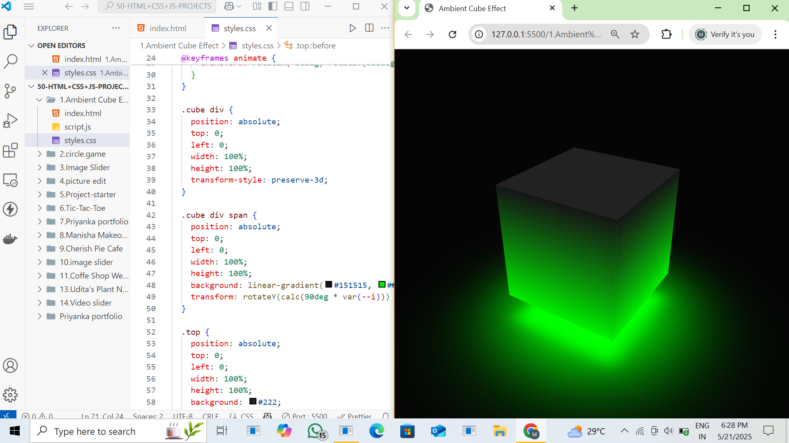
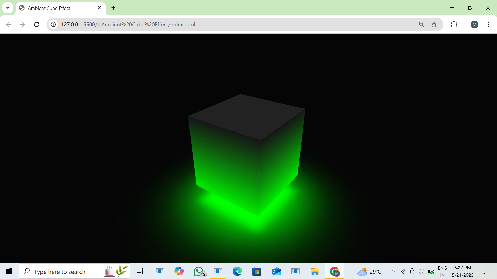

# Ambient Cube Effect

This project showcases a glowing 3D ambient cube using HTML, CSS, and JavaScript. The cube rotates with an ambient green glow for a visually immersive experience.

## 🔗 Live Site  
[Click here to view the live demo](https://9940-pg.github.io/Ambient-Cube-Effects/)  
(Replace with your actual deployed URL if different)

## Features
- 3D cube with green ambient light
- CSS-only animation using keyframes
- Modern and responsive UI

## Technologies Used
- HTML
- CSS (3D transforms, gradients, animations)
- JavaScript (minimal, if used)

## Screenshots

  


## How to Run
1. Clone the repository:
   ```bash
   git clone https://github.com/9940-pg/Ambient-Cube-Effects.git
